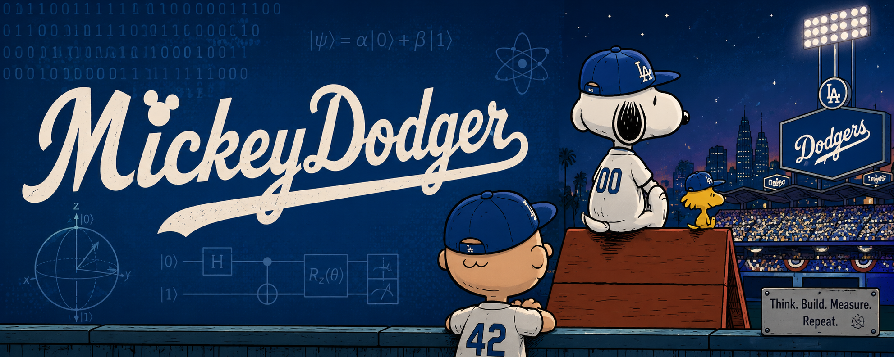

  

I work on a weird mix of things.

Embedded systems. Computer vision. Robotics. World models. Quantum computing. Multi-agent software engineering.

On paper, that sounds all over the place. It really isn’t.

Most of the stuff I like working on has the same problem underneath it: software has to interact with something messy and real, and being *mostly right* isn’t good enough.

I’ve worked on camera systems running across millions of connected devices, autonomous delivery systems operating in the real world, edge AI, computer vision, firmware and device reliability, and now quantum error mitigation and scientific software.

Lately I’ve gone pretty deep on quantum computing and built a reproducible study of zero-noise extrapolation for quantum many-body scar dynamics. I’m also contributing upstream to [Mitiq](https://github.com/unitaryfoundation/mitiq), [qBraid](https://github.com/qBraid/qBraid), and the broader quantum ecosystem, mostly around error mitigation, quantum interoperability, transpilation, and the weird edge cases that can make technically valid-looking software physically wrong.

Outside of quantum, I spend a lot of time thinking about:

`embedded systems` · `edge AI` · `computer vision` · `robotics` · `world models` · `embodied AI` · `autonomous systems` · `multimodal models` · `scientific computing` · `multi-agent systems`

The common thread for me is pretty simple. **I like hard systems where the software has to actually work and interact with the real world.**
